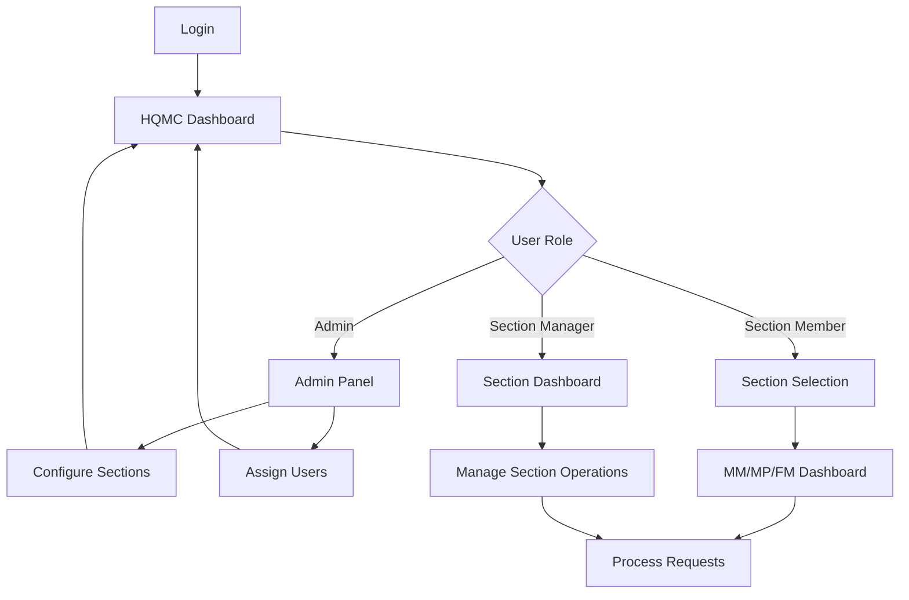

## 1. Product Overview
HQMC (Headquarters Marine Corps) system manages document workflows for main sections including MM (Manpower & Reserve Affairs), MP (Plans, Policies & Operations), and FM (Facilities & Services). The system enables admin-managed section operations with dedicated dashboards for each main section, similar to installation-level functionality but focused on headquarters operations.

## 2. Core Features

### 2.1 User Roles
| Role | Registration Method | Core Permissions |
|------|---------------------|------------------|
| HQMC Admin | System assignment | Manage all sections, assign users to sections, configure workflows |
| Section Member | Admin assignment | View and manage requests within assigned section |
| Section Manager | Admin promotion | Oversee section operations, manage member assignments |

### 2.2 Feature Module
The HQMC system consists of the following main pages:
1. **HQMC Dashboard**: overview of all main sections (MM, MP, FM), section statistics, recent activities.
2. **Section Dashboard**: section-specific request management, filtering, and workflow tracking.
3. **Admin Panel**: section management, user assignments, configuration settings.

### 2.3 Page Details
| Page Name | Module Name | Feature description |
|-----------|-------------|---------------------|
| HQMC Dashboard | Section Overview | Display main sections (MM, MP, FM) with request counts, pending items, and recent activities for each section |
| HQMC Dashboard | Navigation Hub | Quick access buttons to each section dashboard with status indicators showing active requests |
| Section Dashboard | Request Management | View, filter, and manage requests specific to MM, MP, or FM sections with status tracking |
| Section Dashboard | Workflow Tracking | Monitor document approval stages and routing within the section |
| Admin Panel | Section Configuration | Create and manage main sections, define section responsibilities and workflows |
| Admin Panel | User Assignment | Assign users to specific sections (MM, MP, FM) and set role permissions |
| Admin Panel | System Settings | Configure notification preferences, approval chains, and document templates |

## 3. Core Process
HQMC Admin Flow:
1. Admin logs into HQMC system and accesses Admin Panel
2. Creates main sections (MM, MP, FM) with appropriate configurations
3. Assigns users to specific sections based on their roles
4. Configures workflow settings and approval chains for each section
5. Monitors system activity through HQMC Dashboard

Section Member Flow:
1. Member logs in and views HQMC Dashboard showing all available sections
2. Selects their assigned section (MM, MP, or FM) from the dashboard
3. Accesses Section Dashboard to view section-specific requests
4. Processes requests according to section workflows
5. Tracks request status and updates as needed

Section Manager Flow:
1. Manager accesses Section Dashboard for their section
2. Oversees all requests within the section
3. Manages member assignments and workload distribution
4. Monitors section performance and workflow efficiency

## 4. User Interface Design

### 4.1 Design Style
- Primary colors: Marine Corps scarlet (#B22234), Marine Corps gold (#FFD700)
- Secondary colors: Navy blue (#1E3A5F), Light gray (#F5F5F5), White (#FFFFFF)
- Button style: Rounded corners with military precision styling
- Font: Sans-serif, 14px for body text, 18px for section headers
- Layout style: Card-based with clear section divisions and hierarchical navigation
- Icons: Military and administrative themed icons for section identification

### 4.2 Page Design Overview
| Page Name | Module Name | UI Elements |
|-----------|-------------|-------------|
| HQMC Dashboard | Section Overview | Three prominent cards for MM, MP, FM sections with request counters, status badges, and activity timelines in Marine Corps colors |
| HQMC Dashboard | Navigation Hub | Large section buttons with icons representing each main area, color-coded status indicators for active requests |
| Section Dashboard | Request Management | Tabular layout with military-style data presentation, filter controls aligned horizontally, action buttons with icon indicators |
| Admin Panel | Section Configuration | Form-based interface with dropdown selections for section types, configuration panels with save/cancel actions |
| Admin Panel | User Assignment | Dual-list interface for assigning users to sections, drag-and-drop or button-based assignment controls |

### 4.3 Responsiveness
Desktop-first design approach with mobile adaptation for field operations. The dashboard maintains full functionality on tablets while simplifying navigation for mobile devices. Touch-optimized controls for military tablet use in various operational environments.