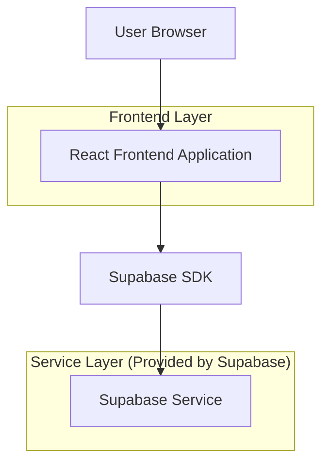
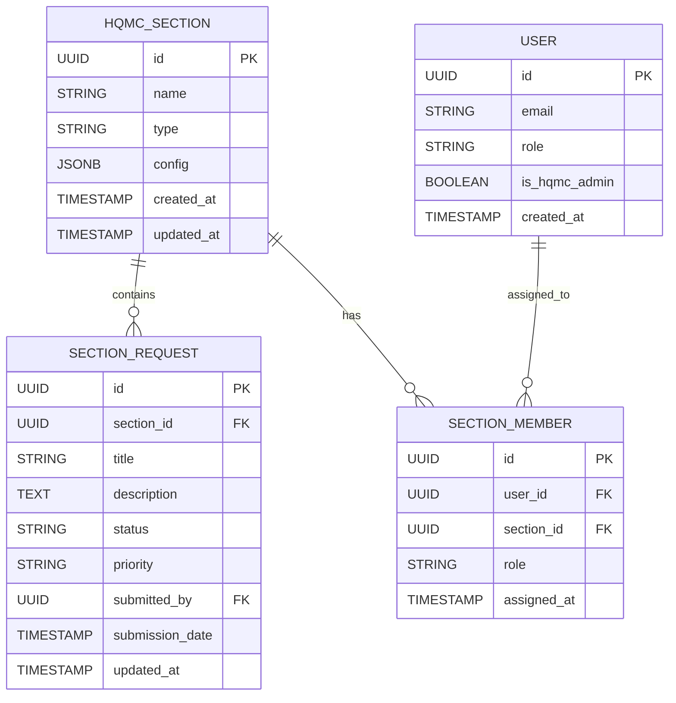

## 1. Architecture design



## 2. Technology Description
- Frontend: React@18 + tailwindcss@3 + vite
- Initialization Tool: vite-init
- Backend: Supabase (PostgreSQL)

## 3. Route definitions
| Route | Purpose |
|-------|---------|
| /hqmc-dashboard | Main HQMC dashboard showing all sections (MM, MP, FM) with overview statistics |
| /hqmc-section/:sectionType | Section-specific dashboard for MM, MP, or FM with request management |
| /hqmc-admin | Admin panel for managing sections and user assignments |

## 4. API definitions

### 4.1 Core API

Section overview data retrieval
```
GET /api/hqmc-sections
```

Request:
| Param Name| Param Type  | isRequired  | Description |
|-----------|-------------|-------------|-------------|
| user_id   | string      | true        | The ID of the current user |

Response:
| Param Name| Param Type  | Description |
|-----------|-------------|-------------|
| sections  | array       | Array of section objects with metadata |

Example
```json
{
  "sections": [
    {
      "id": "sec_mm_001",
      "name": "MM - Manpower & Reserve Affairs",
      "type": "MM",
      "request_count": 45,
      "pending_count": 12,
      "recent_activity": 3
    },
    {
      "id": "sec_mp_001",
      "name": "MP - Plans, Policies & Operations",
      "type": "MP",
      "request_count": 32,
      "pending_count": 8,
      "recent_activity": 2
    },
    {
      "id": "sec_fm_001",
      "name": "FM - Facilities & Services",
      "type": "FM",
      "request_count": 28,
      "pending_count": 5,
      "recent_activity": 1
    }
  ]
}
```

Section-specific requests retrieval
```
GET /api/section-requests/:sectionType
```

Request:
| Param Name| Param Type  | isRequired  | Description |
|-----------|-------------|-------------|-------------|
| sectionType| string     | true        | Section type (MM, MP, FM) |
| status    | string      | false       | Filter by request status |
| priority  | string      | false       | Filter by priority level |
| page      | number      | false       | Page number for pagination |
| limit     | number      | false       | Items per page |

Response:
| Param Name| Param Type  | Description |
|-----------|-------------|-------------|
| requests  | array       | Array of request objects |
| total     | number      | Total count of requests |
| section_info| object    | Section metadata |

Section management for admins
```
POST /api/admin/sections
```

Request:
| Param Name| Param Type  | isRequired  | Description |
|-----------|-------------|-------------|-------------|
| name      | string      | true        | Section name |
| type      | string      | true        | Section type (MM, MP, FM) |
| config    | object      | false       | Section configuration settings |

User assignment to sections
```
POST /api/admin/assign-user
```

Request:
| Param Name| Param Type  | isRequired  | Description |
|-----------|-------------|-------------|-------------|
| user_id   | string      | true        | User ID to assign |
| section_id| string      | true        | Target section ID |
| role      | string      | true        | User role in section |

## 5. Server architecture diagram
Not applicable - Using Supabase backend-as-a-service

## 6. Data model

### 6.1 Data model definition


### 6.2 Data Definition Language

HQMC Sections Table (hqmc_sections)
```sql
-- create table
CREATE TABLE hqmc_sections (
    id UUID PRIMARY KEY DEFAULT gen_random_uuid(),
    name VARCHAR(255) NOT NULL,
    type VARCHAR(10) NOT NULL CHECK (type IN ('MM', 'MP', 'FM')),
    config JSONB DEFAULT '{}',
    created_at TIMESTAMP WITH TIME ZONE DEFAULT NOW(),
    updated_at TIMESTAMP WITH TIME ZONE DEFAULT NOW()
);

-- create index
CREATE INDEX idx_hqmc_sections_type ON hqmc_sections(type);
CREATE INDEX idx_hqmc_sections_name ON hqmc_sections(name);

-- grant permissions
GRANT SELECT ON hqmc_sections TO anon;
GRANT ALL PRIVILEGES ON hqmc_sections TO authenticated;
```

Section Requests Table (section_requests)
```sql
-- create table
CREATE TABLE section_requests (
    id UUID PRIMARY KEY DEFAULT gen_random_uuid(),
    section_id UUID NOT NULL REFERENCES hqmc_sections(id),
    title VARCHAR(255) NOT NULL,
    description TEXT,
    status VARCHAR(20) DEFAULT 'pending' CHECK (status IN ('pending', 'approved', 'rejected', 'in_review')),
    priority VARCHAR(10) DEFAULT 'medium' CHECK (priority IN ('low', 'medium', 'high')),
    submitted_by UUID NOT NULL REFERENCES auth.users(id),
    submission_date TIMESTAMP WITH TIME ZONE DEFAULT NOW(),
    updated_at TIMESTAMP WITH TIME ZONE DEFAULT NOW()
);

-- create index
CREATE INDEX idx_section_requests_section_id ON section_requests(section_id);
CREATE INDEX idx_section_requests_status ON section_requests(status);
CREATE INDEX idx_section_requests_priority ON section_requests(priority);
CREATE INDEX idx_section_requests_submission_date ON section_requests(submission_date DESC);

-- grant permissions
GRANT SELECT ON section_requests TO anon;
GRANT ALL PRIVILEGES ON section_requests TO authenticated;
```

Section Members Table (section_members)
```sql
-- create table
CREATE TABLE section_members (
    id UUID PRIMARY KEY DEFAULT gen_random_uuid(),
    user_id UUID NOT NULL REFERENCES auth.users(id),
    section_id UUID NOT NULL REFERENCES hqmc_sections(id),
    role VARCHAR(50) DEFAULT 'member' CHECK (role IN ('member', 'manager', 'admin')),
    assigned_at TIMESTAMP WITH TIME ZONE DEFAULT NOW(),
    UNIQUE(user_id, section_id)
);

-- create index
CREATE INDEX idx_section_members_user_id ON section_members(user_id);
CREATE INDEX idx_section_members_section_id ON section_members(section_id);

-- grant permissions
GRANT SELECT ON section_members TO anon;
GRANT ALL PRIVILEGES ON section_members TO authenticated;
```

Row Level Security Policies
```sql
-- Users can view sections they are members of
CREATE POLICY "Members can view assigned sections" ON hqmc_sections
    FOR SELECT USING (
        id IN (
            SELECT section_id FROM section_members 
            WHERE user_id = auth.uid()
        )
    );

-- Admins can view all sections
CREATE POLICY "Admins can view all sections" ON hqmc_sections
    FOR SELECT USING (
        EXISTS (
            SELECT 1 FROM auth.users 
            WHERE id = auth.uid() AND is_hqmc_admin = true
        )
    );

-- Section members can view requests in their section
CREATE POLICY "Members can view section requests" ON section_requests
    FOR SELECT USING (
        section_id IN (
            SELECT section_id FROM section_members 
            WHERE user_id = auth.uid()
        )
    );

-- Users can create requests in their section
CREATE POLICY "Members can create section requests" ON section_requests
    FOR INSERT WITH CHECK (
        section_id IN (
            SELECT section_id FROM section_members 
            WHERE user_id = auth.uid()
        )
    );
```