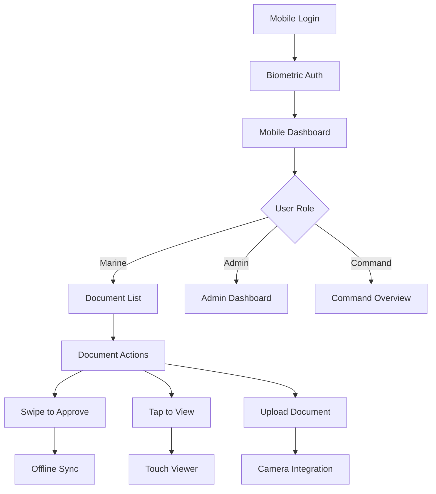

## 1. Product Overview

Transform the Electronic Document Management System (EDMS) into a mobile-first, accessible application with optimized user experience across all devices. The improvements focus on responsive design patterns, touch-friendly interfaces, and streamlined navigation for military personnel accessing the system on mobile devices in field conditions.

Target users include Marines and military staff who need reliable document management capabilities on smartphones and tablets, with particular attention to usability in challenging environments with limited connectivity and varying lighting conditions.

## 2. Core Features

### 2.1 User Roles

| Role           | Mobile Access Level        | Core Permissions                                  |
| -------------- | -------------------------- | ------------------------------------------------- |
| Marine/Soldier | Full mobile access         | Submit documents, view status, basic navigation   |
| Unit Admin     | Enhanced mobile interface  | Document review, user management, admin functions |
| Command Staff  | Mobile-optimized dashboard | Strategic overview, approval workflows            |
| App Admin      | Full mobile admin panel    | System configuration, user administration         |

### 2.2 Feature Module

Our mobile UI/UX optimization consists of the following enhanced interfaces:

1. **Mobile-Optimized Login**: Touch-friendly authentication with biometric support, simplified form layout
2. **Responsive Dashboard**: Adaptive grid layouts, collapsible navigation, touch-optimized controls
3. **Document Management Interface**: Swipe gestures, mobile file upload, simplified document viewer
4. **Navigation System**: Bottom navigation bar, hamburger menu, contextual action buttons
5. **Form Interfaces**: Large touch targets, voice input support, progressive disclosure
6. **Accessibility Features**: High contrast mode, screen reader support, keyboard navigation

### 2.3 Page Details

| Page Name        | Module Name            | Feature description                                                                                                                     |
| ---------------- | ---------------------- | --------------------------------------------------------------------------------------------------------------------------------------- |
| Mobile Login     | Authentication Form    | Implement biometric login (fingerprint/face), large touch targets (44px minimum), password visibility toggle, remember me functionality |
| Mobile Dashboard | Responsive Grid Layout | Collapsible sidebar navigation, card-based content display, pull-to-refresh functionality, offline status indicator                     |
| Document List    | Mobile Table View      | Swipe actions for document operations, infinite scroll, search/filter bar with voice input, document preview thumbnails                 |
| Document Viewer  | Touch-Optimized Reader | Pinch-to-zoom functionality, page navigation gestures, annotation tools, offline viewing capability                                     |
| Upload Interface | Mobile File Manager    | Camera integration for document capture, drag-and-drop support, progress indicators, file size validation                               |
| Navigation Bar   | Bottom Tab Navigation  | Context-aware action buttons, quick access to frequently used features, notification badges, haptic feedback                            |
| Form Interfaces  | Touch-Friendly Forms   | Large input fields with clear labels, input validation with inline feedback, numeric keypad for ID fields, voice input support          |
| Settings Panel   | Accessibility Controls | Font size adjustment, high contrast toggle, color blind mode, screen reader announcements                                               |

## 3. Core Process

### Mobile User Flow

Users access the system through mobile-optimized authentication, navigate via touch-friendly interfaces, and complete document workflows with gesture-based interactions. The system adapts to different screen sizes and orientations while maintaining functionality in offline scenarios.

### Accessibility Flow

Screen reader users receive proper ARIA labels and announcements, keyboard navigation follows logical tab order, and high contrast mode ensures visibility in various lighting conditions common in military environments.

## 4. User Interface Design

### 4.1 Design Style

* **Primary Colors**: Maintain existing military color scheme (brand-navy #112B3F, brand-red #C43A3A)

* **Mobile Color Adaptations**: Higher contrast ratios, larger color blocks for touch targets

* **Typography**: System fonts for optimal mobile performance, minimum 16px base font size

* **Touch Targets**: Minimum 44px × 44px for all interactive elements

* **Spacing**: Increased padding for mobile (16px minimum), generous white space for touch accuracy

* **Icons**: Larger icon sizes (24px minimum), high contrast variants, descriptive labels

### 4.2 Page Design Overview

| Page Name        | Module Name         | UI Elements                                                                                                                                                      |
| ---------------- | ------------------- | ---------------------------------------------------------------------------------------------------------------------------------------------------------------- |
| Mobile Login     | Authentication Card | Centered card layout, large input fields with 16px font, prominent login button with 48px height, biometric login button below password field                    |
| Mobile Dashboard | Responsive Cards    | Stacked card layout on mobile, horizontal scroll for quick actions, prominent status indicators with large icons, pull-to-refresh gesture support                |
| Document List    | Mobile Table        | Card-based list items with swipe actions, large document thumbnails (80px), prominent action buttons at bottom of screen, sticky search bar                      |
| Document Viewer  | Touch Interface     | Full-screen viewing mode, gesture-based navigation (swipe left/right for pages), zoom controls in bottom toolbar, offline viewing indicator                      |
| Upload Interface | Camera Integration  | Large camera button for document capture, file selection with visual previews, progress bars with percentage indicators, drag-and-drop zone with visual feedback |

### 4.3 Responsiveness

**Mobile-First Design Approach**: All components designed for mobile screens first, then scaled up for larger devices

**Breakpoint Strategy**:

* Mobile: 320px - 768px (primary focus)

* Tablet: 768px - 1024px (enhanced layouts)

* Desktop: 1024px+ (expanded functionality)

**Touch Interaction Optimization**:

* Swipe gestures for document actions

* Pinch-to-zoom for document viewing

* Long-press for context menus

* Haptic feedback for successful actions

* Edge swipes for navigation

**Accessibility Features**:

* WCAG 2.1 AA compliance for color contrast

* Screen reader support with proper ARIA labels

* Keyboard navigation support

* High contrast mode toggle

* Font size adjustment (100% - 200%)

* Voice input integration for form fields

* Offline capability

