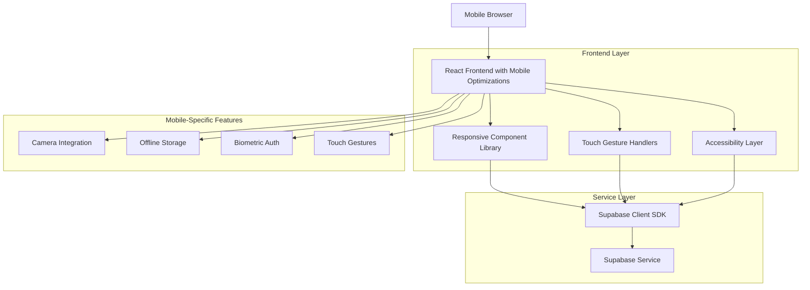
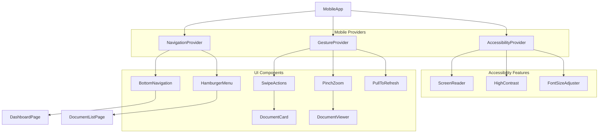
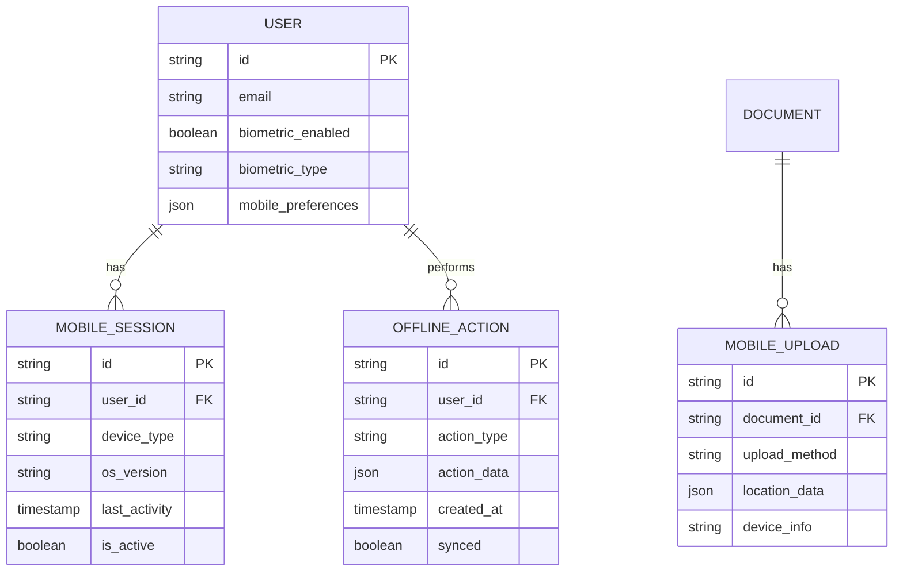

## 1. Architecture Design

The mobile UI/UX optimization maintains the existing React + Supabase architecture while implementing responsive design patterns and accessibility features. The system uses a mobile-first approach with progressive enhancement for larger screens.



## 2. Technology Description

**Frontend Enhancements:**
- React@18 with mobile-optimized hooks and components
- TailwindCSS@3 with extended responsive utilities and mobile-first breakpoints
- Framer Motion for smooth touch animations and gesture handling
- React Hook Form with mobile-optimized validation
- Vite with PWA plugin for offline functionality

**Mobile-Specific Libraries:**
- React Touch Events for gesture recognition
- Capacitor.js for native mobile features (camera, biometrics)
- Workbox for service worker and offline caching
- React Aria for accessibility components

**Initialization Tool:** vite-init (maintaining existing setup)

**Backend:** Supabase (existing architecture maintained)

## 3. Route Definitions

Enhanced routes with mobile-specific views:

| Route | Purpose | Mobile Optimization |
|-------|---------|-------------------|
| / | Mobile-optimized home with touch navigation | Bottom navigation bar, swipe gestures |
| /login | Biometric-enabled login screen | Fingerprint/face unlock, large touch targets |
| /dashboard | Responsive dashboard layout | Collapsible cards, pull-to-refresh |
| /documents | Mobile document list with swipe actions | Infinite scroll, swipe-to-approve |
| /document/:id | Touch-optimized document viewer | Pinch-to-zoom, gesture navigation |
| /upload | Camera-integrated upload interface | Camera capture, drag-and-drop |
| /profile | Mobile-friendly profile management | Large form fields, voice input |
| /admin | Responsive admin panel | Mobile-optimized data tables |

## 4. API Definitions

### 4.1 Mobile-Specific APIs

**Biometric Authentication**
```
POST /api/auth/biometric
```

Request:
| Param Name | Param Type | isRequired | Description |
|------------|------------|-------------|-------------|
| biometricType | string | true | Type of biometric (fingerprint/face) |
| challenge | string | true | Authentication challenge |

Response:
| Param Name | Param Type | Description |
|------------|-------------|-------------|
| authenticated | boolean | Biometric authentication status |
| token | string | Session token for mobile app |

**Document Upload with Camera**
```
POST /api/documents/upload-mobile
```

Request:
| Param Name | Param Type | isRequired | Description |
|------------|------------|-------------|-------------|
| imageData | base64 | true | Base64 encoded image from camera |
| metadata | object | true | Document metadata (type, size, etc.) |
| location | object | false | GPS coordinates if available |

**Offline Sync**
```
POST /api/sync/offline-data
```

Request:
| Param Name | Param Type | isRequired | Description |
|------------|------------|-------------|-------------|
| pendingActions | array | true | Array of offline actions to sync |
| lastSyncTime | timestamp | true | Last successful sync timestamp |

## 5. Component Architecture

### 5.1 Mobile Component Structure



### 5.2 Key Mobile Components

**MobileLayout Component**
- Handles responsive breakpoints
- Manages orientation changes
- Provides safe area insets for notched devices

**TouchOptimizedButton**
- Minimum 44px × 44px touch target
- Haptic feedback on press
- Loading states with visual feedback

**SwipeActionCard**
- Swipe left/right for actions
- Visual feedback during swipe
- Accessibility-friendly alternative buttons

**PullToRefreshContainer**
- Native-like pull gesture
- Loading indicator
- Offline state handling

## 6. Data Model Updates

### 6.1 Mobile-Specific Extensions



### 6.2 Database Schema Updates

**Mobile Sessions Table**
```sql
CREATE TABLE mobile_sessions (
    id UUID PRIMARY KEY DEFAULT gen_random_uuid(),
    user_id UUID REFERENCES users(id) ON DELETE CASCADE,
    device_type VARCHAR(50),
    os_version VARCHAR(50),
    last_activity TIMESTAMP WITH TIME ZONE DEFAULT NOW(),
    is_active BOOLEAN DEFAULT true,
    created_at TIMESTAMP WITH TIME ZONE DEFAULT NOW()
);

CREATE INDEX idx_mobile_sessions_user_id ON mobile_sessions(user_id);
CREATE INDEX idx_mobile_sessions_active ON mobile_sessions(is_active);
```

**Offline Actions Table**
```sql
CREATE TABLE offline_actions (
    id UUID PRIMARY KEY DEFAULT gen_random_uuid(),
    user_id UUID REFERENCES users(id) ON DELETE CASCADE,
    action_type VARCHAR(100) NOT NULL,
    action_data JSONB NOT NULL,
    created_at TIMESTAMP WITH TIME ZONE DEFAULT NOW(),
    synced BOOLEAN DEFAULT false
);

CREATE INDEX idx_offline_actions_user_id ON offline_actions(user_id);
CREATE INDEX idx_offline_actions_synced ON offline_actions(synced);
```

## 7. Mobile-Specific Services

### 7.1 Camera Service
```typescript
interface CameraService {
    captureDocument(): Promise<Blob>
    scanQRCode(): Promise<string>
    getPhotoMetadata(): Promise<LocationData>
}
```

### 7.2 Biometric Service
```typescript
interface BiometricService {
    isAvailable(): Promise<boolean>
    authenticate(challenge: string): Promise<boolean>
    enroll(): Promise<void>
}
```

### 7.3 Offline Service
```typescript
interface OfflineService {
    cacheDocument(documentId: string): Promise<void>
    queueAction(action: OfflineAction): Promise<void>
    syncPendingActions(): Promise<void>
    isOnline(): boolean
}
```

## 8. Testing Strategy

### 8.1 Mobile Testing Approach

**Unit Testing:**
- Component testing with React Testing Library
- Gesture handler testing with mock touch events
- Accessibility testing with jest-axe

**Integration Testing:**
- End-to-end mobile workflows with Cypress
- Cross-device testing with BrowserStack
- Performance testing on low-end devices

**User Acceptance Testing:**
- Field testing with military personnel
- Usability testing in various lighting conditions
- Accessibility testing with screen readers

### 8.2 Performance Metrics

**Core Web Vitals for Mobile:**
- LCP (Largest Contentful Paint) < 2.5s
- FID (First Input Delay) < 100ms
- CLS (Cumulative Layout Shift) < 0.1

**Mobile-Specific Metrics:**
- Touch response time < 50ms
- Gesture recognition accuracy > 95%
- Offline functionality availability > 90%

### 8.3 Accessibility Compliance

**WCAG 2.1 Level AA Requirements:**
- Color contrast ratio ≥ 4.5:1
- Touch target size ≥ 44px × 44px
- Screen reader compatibility
- Keyboard navigation support
- High contrast mode support

**Military-Specific Accessibility:**
- Glove-friendly interface design
- High visibility mode for field conditions
- Voice command integration
- One-handed operation support