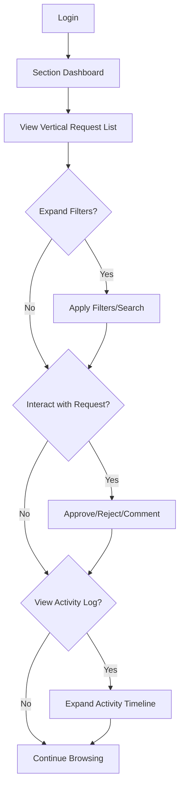

## 1. Product Overview
The Section Dashboard provides battalion section members with a centralized view of their pending requests in a streamlined single-column vertical layout. This redesign transitions from the current card-based side-by-side display to a vertical list format that improves readability and maintains all existing functionality while enhancing responsive behavior across screen sizes.

## 2. Core Features

### 2.1 User Roles
| Role | Registration Method | Core Permissions |
|------|---------------------|------------------|
| Section Member | System assignment via battalion section | View own pending requests, filter and search requests, approve/reject requests, add comments and files |
| Section Supervisor | System assignment via battalion section | All member permissions plus routing to command sections |

### 2.2 Feature Module
The Section Dashboard consists of the following main page:
1. **Section Dashboard**: vertical request list, filtering controls, request actions, responsive layout transitions.

### 2.3 Page Details
| Page Name | Module Name | Feature description |
|-----------|-------------|---------------------|
| Section Dashboard | Vertical Request List | Display all requests in a single-column vertical layout with clear visual hierarchy, expandable sections for pending and historical requests |
| Section Dashboard | Request Item Component | Each request displayed as a vertically stacked item with subject, metadata, documents, actions, and expandable activity log |
| Section Dashboard | Visual Hierarchy | Clear spacing and typography hierarchy with section headers, request items, and nested components |
| Section Dashboard | Responsive Behavior | Smooth transitions between desktop and mobile layouts with touch-optimized interactions |
| Section Dashboard | Filter Controls | Collapsible filter panel with status, date range, and section filtering options |
| Section Dashboard | Request Actions | Approve/Return buttons, file attachment interface, comment input, and command routing dropdown |
| Section Dashboard | Document Display | Document list within each request item with open/download capabilities |
| Section Dashboard | Activity Log | Expandable activity timeline showing approval history and comments |

## 3. Core Process
Section Member Flow:
1. Member logs into the system and navigates to Section Dashboard
2. System displays all requests in vertical list format with clear section separation
3. Member can expand/collapse filter controls for refined searching
4. Member can scroll through single-column list with smooth transitions
5. Member can interact with individual request items (approve, reject, add files/comments)
6. Member can expand activity logs to view request history
7. Layout automatically adapts to screen size with preserved functionality

## 4. User Interface Design

### 4.1 Design Style
- Primary colors: Military green (#4A5D23), Navy blue (#1E3A5F)
- Secondary colors: Light gray (#F5F5F5), White (#FFFFFF), Cream (#FDF6E3)
- Button style: Rounded corners with military-style icons, consistent hover states
- Font: Sans-serif, 16px for body text, 20px for headers, 14px for metadata
- Layout style: Single-column vertical list with card-based request items
- Spacing: Consistent 24px between major sections, 16px between request items
- Transitions: Smooth 300ms transitions for layout changes and interactions

### 4.2 Page Design Overview
| Page Name | Module Name | UI Elements |
|-----------|-------------|-------------|
| Section Dashboard | Vertical List Container | Full-width container with max-width constraint, subtle background shading for section separation, smooth scroll behavior |
| Section Dashboard | Request Item Card | White background with border, 16px padding, rounded corners, shadow on hover, clear visual separation between header, content, and actions |
| Section Dashboard | Request Header | Bold title font, metadata row with consistent spacing, status badges with color coding |
| Section Dashboard | Document List | Indented document items with file icons, consistent spacing, download buttons aligned right |
| Section Dashboard | Action Controls | Bottom-aligned button group, consistent spacing, primary/secondary button hierarchy |
| Section Dashboard | Mobile Adaptation | Touch-friendly tap targets, simplified layouts, collapsible sections for smaller screens |

### 4.3 Responsiveness
Desktop-first design approach with mobile adaptation. The vertical list maintains single-column structure across all screen sizes with responsive spacing adjustments. Touch interaction optimization for tablet and mobile use with larger tap targets and simplified interaction patterns. Smooth CSS transitions ensure continuity during screen size changes.