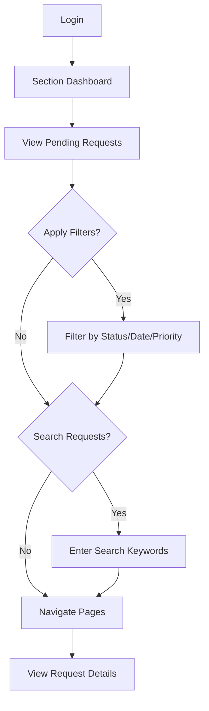

## 1. Product Overview
The Section Dashboard provides battalion section members with a centralized view of their pending requests. This page enables members to track and monitor their document requests within their assigned battalion section.

## 2. Core Features

### 2.1 User Roles
| Role | Registration Method | Core Permissions |
|------|---------------------|------------------|
| Section Member | System assignment via battalion section | View own pending requests, filter and search requests |

### 2.2 Feature Module
The Section Dashboard consists of the following main page:
1. **Section Dashboard**: pending requests list, filtering options, pagination controls.

### 2.3 Page Details
| Page Name | Module Name | Feature description |
|-----------|-------------|---------------------|
| Section Dashboard | Request List | Display all pending requests for the logged-in section member with request details including title, status, submission date, and priority level |
| Section Dashboard | Filter Controls | Filter requests by status (pending, approved, rejected), date range, and priority level |
| Section Dashboard | Search Function | Search requests by title or description using keyword input |
| Section Dashboard | Pagination | Navigate through large sets of requests with configurable items per page (10, 25, 50) |
| Section Dashboard | Request Actions | View detailed request information and track approval workflow status |

## 3. Core Process
Section Member Flow:
1. Member logs into the system and navigates to Section Dashboard
2. System displays all pending requests assigned to the member
3. Member can filter requests by status, date range, or priority
4. Member can search for specific requests using keywords
5. Member can navigate through paginated results
6. Member can click on any request to view detailed information

## 4. User Interface Design

### 4.1 Design Style
- Primary colors: Military green (#4A5D23), Navy blue (#1E3A5F)
- Secondary colors: Light gray (#F5F5F5), White (#FFFFFF)
- Button style: Rounded corners with military-style icons
- Font: Sans-serif, 14px for body text, 16px for headers
- Layout style: Card-based with clear section divisions
- Icons: Military-themed icons for status indicators

### 4.2 Page Design Overview
| Page Name | Module Name | UI Elements |
|-----------|-------------|-------------|
| Section Dashboard | Request List | Card-based layout with each request in a bordered card, status badges with color coding (green-approved, yellow-pending, red-rejected), date stamps in military format (DD MMM YYYY) |
| Section Dashboard | Filter Controls | Dropdown menus for status and priority, date picker for range selection, military-style buttons with icon indicators |
| Section Dashboard | Search Function | Search bar with magnifying glass icon, placeholder text "Search by title or description...", instant search as user types |
| Section Dashboard | Pagination | Numbered page buttons, previous/next arrows, items per page dropdown in top-right corner |

### 4.3 Responsiveness
Desktop-first design approach with mobile adaptation. The dashboard will stack filter controls vertically on mobile devices while maintaining full functionality. Touch interaction optimization for tablet use in field operations.