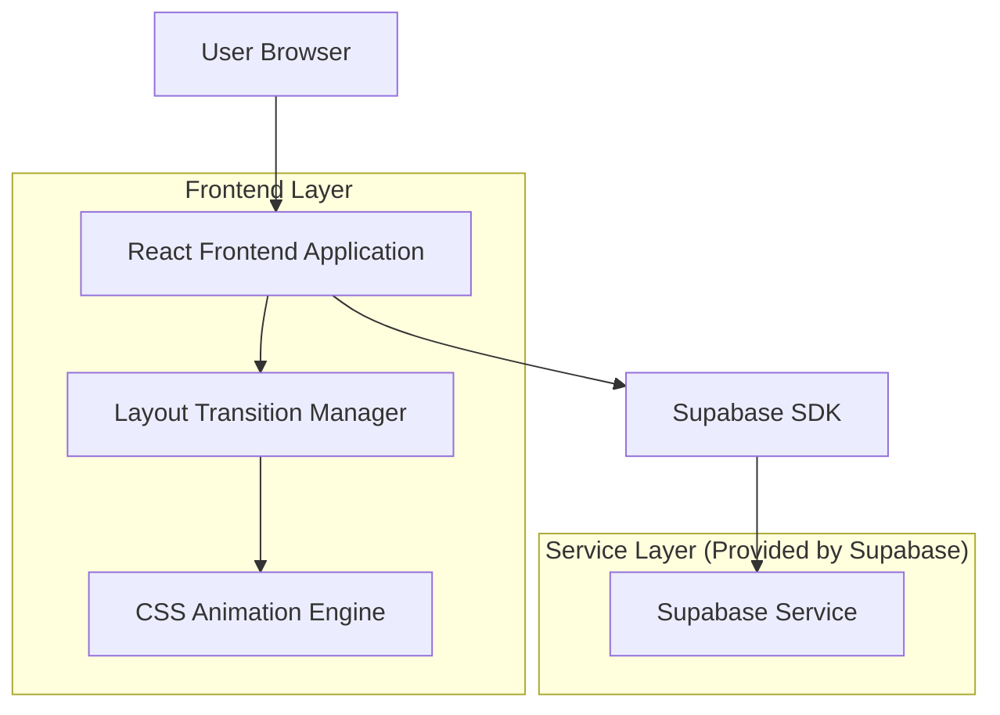
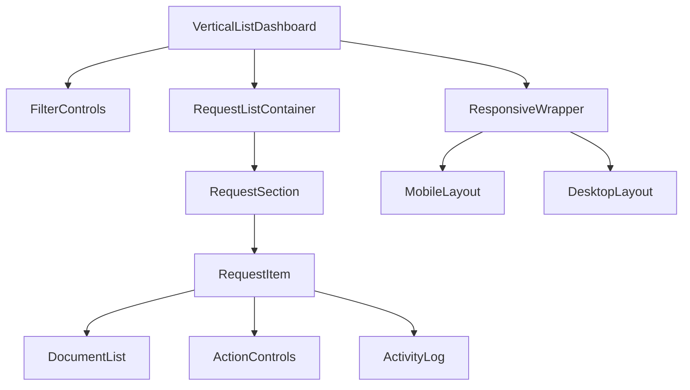
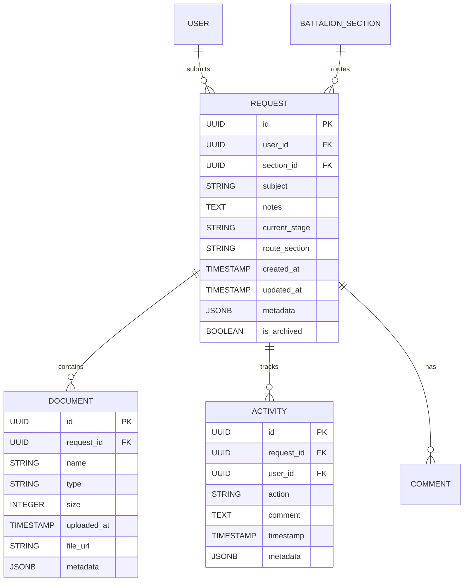

## 1. Architecture design



## 2. Technology Description
- Frontend: React@18 + tailwindcss@3 + vite
- Initialization Tool: vite-init
- Backend: Supabase (PostgreSQL)
- Animation Library: Framer Motion (optional for advanced transitions)
- State Management: React Context + useState hooks

## 3. Route definitions
| Route | Purpose |
|-------|---------|
| /section-dashboard | Section Dashboard page, displays vertical list of requests with filtering and responsive layout |

## 4. Component Architecture

### 4.1 Core Components
```typescript
interface VerticalListDashboardProps {
  requests: Request[]
  onFilterChange: (filters: FilterState) => void
  onRequestAction: (action: RequestAction) => void
  isLoading: boolean
}

interface RequestItemProps {
  request: Request
  isExpanded: boolean
  onToggleExpand: () => void
  onApprove: () => void
  onReject: () => void
  onAddFiles: (files: File[]) => void
  onComment: (comment: string) => void
}

interface ResponsiveLayoutProps {
  children: React.ReactNode
  breakpoint: 'mobile' | 'tablet' | 'desktop'
  transitionDuration: number
}
```

### 4.2 Layout Transition API
```typescript
interface LayoutTransitionConfig {
  from: 'grid' | 'list'
  to: 'grid' | 'list'
  duration: number
  easing: string
  preserveScrollPosition: boolean
}

POST /api/layout-transition
{
  "userId": "user_123",
  "transitionType": "grid-to-list",
  "timestamp": "2024-11-30T10:00:00Z"
}
```

## 5. Frontend Architecture

### 5.1 Component Hierarchy


### 5.2 State Management
```typescript
interface DashboardState {
  requests: Request[]
  filteredRequests: Request[]
  expandedRequests: Set<string>
  filters: {
    status: string[]
    dateRange: { start: Date; end: Date }
    searchQuery: string
  }
  layout: {
    current: 'vertical-list'
    previous: 'card-grid'
    transitionState: 'idle' | 'transitioning'
  }
  ui: {
    isFilterOpen: boolean
    isLoading: boolean
    scrollPosition: number
  }
}
```

## 6. Data Model

### 6.1 Enhanced Request Model


### 6.2 Layout Transition Tracking
```sql
-- Layout Transition History Table
CREATE TABLE layout_transitions (
    id UUID PRIMARY KEY DEFAULT gen_random_uuid(),
    user_id UUID NOT NULL REFERENCES auth.users(id),
    transition_type VARCHAR(50) NOT NULL,
    from_layout VARCHAR(50) NOT NULL,
    to_layout VARCHAR(50) NOT NULL,
    transition_duration INTEGER DEFAULT 300,
    timestamp TIMESTAMP WITH TIME ZONE DEFAULT NOW()
);

CREATE INDEX idx_layout_transitions_user_id ON layout_transitions(user_id);
CREATE INDEX idx_layout_transitions_timestamp ON layout_transitions(timestamp DESC);

GRANT SELECT ON layout_transitions TO anon;
GRANT ALL PRIVILEGES ON layout_transitions TO authenticated;
```

### 6.3 Responsive Design Configuration
```typescript
// Breakpoint configuration
const RESPONSIVE_BREAKPOINTS = {
  mobile: { max: 768, columns: 1, spacing: 16 },
  tablet: { min: 769, max: 1024, columns: 1, spacing: 20 },
  desktop: { min: 1025, columns: 1, spacing: 24 }
} as const;

// Transition timing configuration
const TRANSITION_CONFIG = {
  layout: { duration: 300, easing: 'ease-in-out' },
  expand: { duration: 200, easing: 'ease-out' },
  filter: { duration: 150, easing: 'ease-in' }
} as const;
```

## 7. Performance Optimization

### 7.1 Virtual Scrolling
- Implement virtual scrolling for lists with >50 items
- Use React Window or similar library for efficient rendering
- Maintain scroll position during layout transitions

### 7.2 Lazy Loading
- Request items load incrementally as user scrolls
- Document lists within requests load on-demand
- Activity logs fetch data only when expanded

### 7.3 CSS Optimization
- Use CSS Grid for consistent vertical alignment
- Implement CSS containment for better performance
- Optimize animations with transform and opacity properties