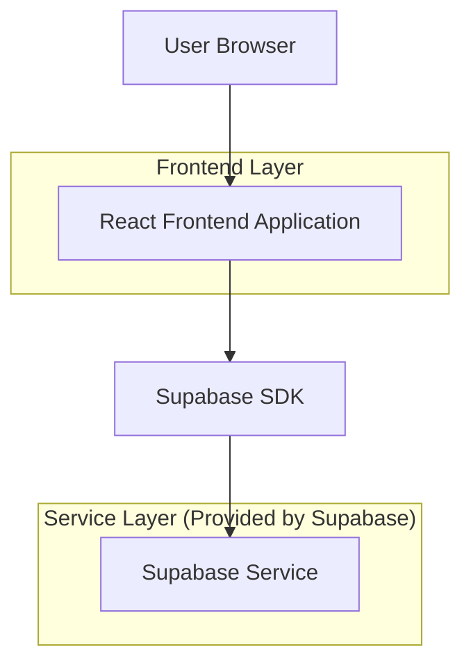
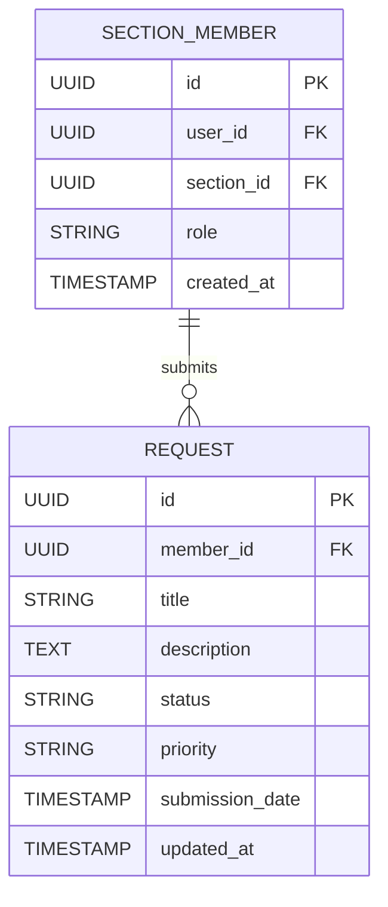

## 1. Architecture design



## 2. Technology Description
- Frontend: React@18 + tailwindcss@3 + vite
- Initialization Tool: vite-init
- Backend: Supabase (PostgreSQL)

## 3. Route definitions
| Route | Purpose |
|-------|---------|
| /section-dashboard | Section Dashboard page, displays member's pending requests with filtering and pagination |

## 4. API definitions

### 4.1 Core API

Request retrieval and filtering
```
GET /api/section-requests
```

Request:
| Param Name| Param Type  | isRequired  | Description |
|-----------|-------------|-------------|-------------|
| member_id | string      | true        | The ID of the section member |
| status    | string      | false       | Filter by request status (pending, approved, rejected) |
| start_date| string      | false       | Start date for date range filter (ISO format) |
| end_date  | string      | false       | End date for date range filter (ISO format) |
| priority  | string      | false       | Filter by priority level (low, medium, high) |
| search    | string      | false       | Search keyword for title/description |
| page      | number      | false       | Page number for pagination (default: 1) |
| limit     | number      | false       | Items per page (default: 10) |

Response:
| Param Name| Param Type  | Description |
|-----------|-------------|-------------|
| requests  | array       | Array of request objects |
| total     | number      | Total count of requests |
| page      | number      | Current page number |
| limit     | number      | Items per page |

Example
```json
{
  "requests": [
    {
      "id": "req_123",
      "title": "Equipment Request",
      "description": "Request for tactical gear",
      "status": "pending",
      "priority": "high",
      "submission_date": "2024-11-30T10:00:00Z",
      "member_id": "mem_456"
    }
  ],
  "total": 25,
  "page": 1,
  "limit": 10
}
```

## 5. Server architecture diagram
Not applicable - Using Supabase backend-as-a-service

## 6. Data model

### 6.1 Data model definition


### 6.2 Data Definition Language

Section Members Table (section_members)
```sql
-- create table
CREATE TABLE section_members (
    id UUID PRIMARY KEY DEFAULT gen_random_uuid(),
    user_id UUID NOT NULL REFERENCES auth.users(id),
    section_id UUID NOT NULL,
    role VARCHAR(50) DEFAULT 'member',
    created_at TIMESTAMP WITH TIME ZONE DEFAULT NOW()
);

-- create index
CREATE INDEX idx_section_members_user_id ON section_members(user_id);
CREATE INDEX idx_section_members_section_id ON section_members(section_id);

-- grant permissions
GRANT SELECT ON section_members TO anon;
GRANT ALL PRIVILEGES ON section_members TO authenticated;
```

Requests Table (requests)
```sql
-- create table
CREATE TABLE requests (
    id UUID PRIMARY KEY DEFAULT gen_random_uuid(),
    member_id UUID NOT NULL REFERENCES section_members(id),
    title VARCHAR(255) NOT NULL,
    description TEXT,
    status VARCHAR(20) DEFAULT 'pending' CHECK (status IN ('pending', 'approved', 'rejected')),
    priority VARCHAR(10) DEFAULT 'medium' CHECK (priority IN ('low', 'medium', 'high')),
    submission_date TIMESTAMP WITH TIME ZONE DEFAULT NOW(),
    updated_at TIMESTAMP WITH TIME ZONE DEFAULT NOW()
);

-- create index
CREATE INDEX idx_requests_member_id ON requests(member_id);
CREATE INDEX idx_requests_status ON requests(status);
CREATE INDEX idx_requests_priority ON requests(priority);
CREATE INDEX idx_requests_submission_date ON requests(submission_date DESC);

-- grant permissions
GRANT SELECT ON requests TO anon;
GRANT ALL PRIVILEGES ON requests TO authenticated;
```

Row Level Security Policies
```sql
-- Section members can only view their own requests
CREATE POLICY "Members can view own requests" ON requests
    FOR SELECT USING (
        member_id IN (
            SELECT id FROM section_members 
            WHERE user_id = auth.uid()
        )
    );

-- Section members can create their own requests
CREATE POLICY "Members can create own requests" ON requests
    FOR INSERT WITH CHECK (
        member_id IN (
            SELECT id FROM section_members 
            WHERE user_id = auth.uid()
        )
    );
```