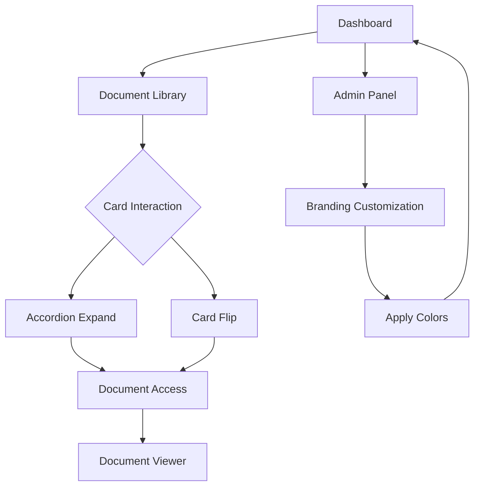

## 1. Product Overview
Implement SEMPER ADMIN branding color scheme across the EDMS application UI, ensuring consistent visual identity with interactive document card components replacing traditional links.

The product transforms document management interface with military-inspired branding while maintaining accessibility and responsive design standards.

## 2. Core Features

### 2.1 User Roles
| Role | Registration Method | Core Permissions |
|------|---------------------|------------------|
| Admin User | System authentication | Full document management, branding customization |
| Standard User | Email/SSO login | Document viewing, download, search |
| Guest User | Limited access | View public documents only |

### 2.2 Feature Module
The EDMS branding implementation consists of the following main pages:
1. **Dashboard**: Document grid with branded cards, navigation header with logo colors
2. **Document Library**: Interactive card components with accordion/flip animations
3. **Document Viewer**: Maintained branding consistency in viewer interface
4. **Admin Panel**: Branding customization tools, color scheme management

### 2.3 Page Details
| Page Name | Module Name | Feature description |
|-----------|-------------|---------------------|
| Dashboard | Header Navigation | Apply #112B3F (navy) background with #F2EBD9 (cream) text, gold #D4A64A accent borders |
| Dashboard | Document Grid | Display documents in branded cards with #C43A3A (red) hover states and #1A1A1A (black) shadows |
| Document Library | Document Cards | Replace links with interactive cards featuring accordion expansion or flip animation |
| Document Library | Card Interactions | Implement hover/focus states with gold #D4A64A highlights and smooth transitions |
| Document Viewer | UI Elements | Maintain color consistency in buttons, badges, and navigation with military-inspired palette |
| Admin Panel | Branding Tools | Allow color scheme customization while preserving SEMPER ADMIN identity |

## 3. Core Process
**Document Access Flow:**
User navigates to Document Library → Views branded document cards → Interacts with card (click/hover) → Card expands via accordion or flips to reveal document details → User accesses document through consistent branded interface

**Admin Branding Flow:**
Admin accesses Admin Panel → Views current color scheme → Modifies branding colors → Preview changes → Apply to entire application → All pages update with new palette

## 4. User Interface Design

### 4.1 Design Style
- **Primary Colors**: #112B3F (navy), #C43A3A (red), #F2EBD9 (cream)
- **Secondary Colors**: #D4A64A (gold), #1A1A1A (black)
- **Button Style**: Military-inspired with gold borders and navy backgrounds
- **Font**: Bold, condensed sans-serif for headers; clean sans-serif for body text
- **Layout**: Card-based grid with consistent spacing and shadows
- **Icons**: Minimalist military-style icons in gold or navy

### 4.2 Page Design Overview
| Page Name | Module Name | UI Elements |
|-----------|-------------|-------------|
| Dashboard | Header | #112B3F background, #F2EBD9 text, #D4A64A border accents, 16px font size |
| Dashboard | Document Cards | #FFFFFF background, #1A1A1A shadow, #C43A3A hover state, rounded corners |
| Document Library | Card Grid | 3-column responsive grid, 20px gaps, consistent card heights |
| Document Library | Card Interactions | Smooth 0.3s transitions, #D4A64A focus rings, accessible keyboard navigation |
| Document Viewer | Action Buttons | #112B3F background, #F2EBD9 text, #D4A64A hover borders |

### 4.3 Responsiveness
Desktop-first design with mobile adaptation:
- Desktop: 3-column card grid, full navigation menu
- Tablet: 2-column grid, condensed navigation
- Mobile: 1-column grid, hamburger menu with slide-out navigation
- Touch optimization: Larger tap targets (44px minimum), swipe gestures for card interactions