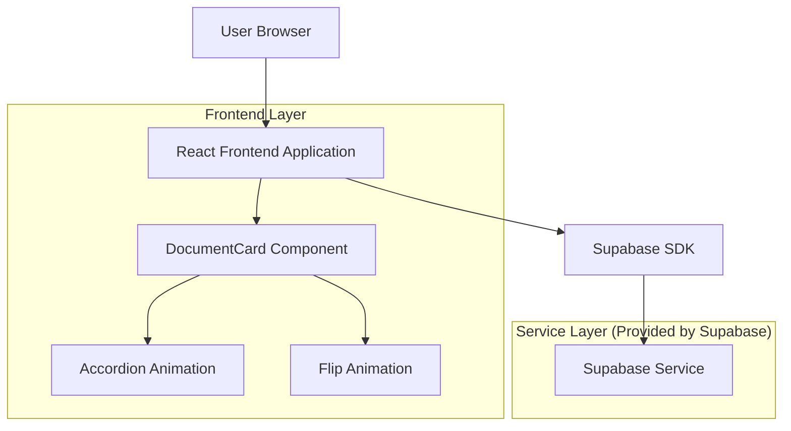
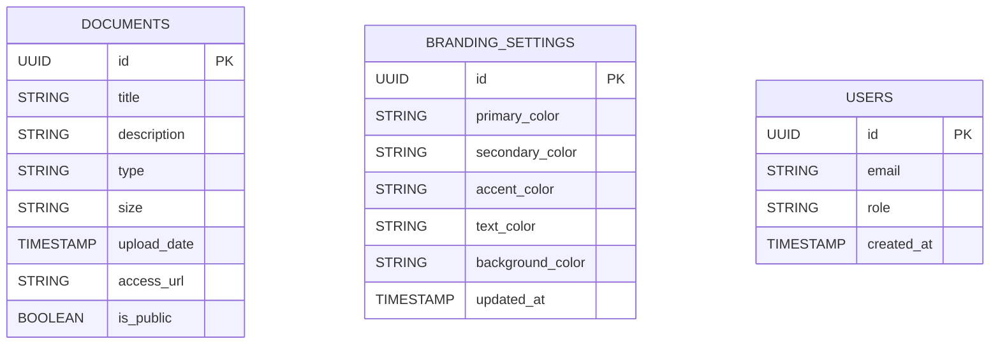

## 1. Architecture Design



## 2. Technology Description
- Frontend: React@18 + tailwindcss@3 + vite
- Initialization Tool: vite-init
- Backend: Supabase (Authentication, Database, Storage)
- Animation Library: framer-motion (for card interactions)
- Color Management: CSS custom properties with SEMPER ADMIN palette

## 3. Route Definitions
| Route | Purpose |
|-------|---------|
| / | Dashboard with branded document grid |
| /documents | Document library with interactive card components |
| /document/:id | Document viewer with consistent branding |
| /admin/branding | Admin panel for color scheme customization |
| /login | Authentication page with branded styling |

## 4. Component Architecture

### 4.1 Core Components
**DocumentCard Component**
```typescript
interface DocumentCardProps {
  document: {
    id: string
    title: string
    description: string
    type: 'pdf' | 'doc' | 'image'
    size: string
    uploadDate: string
  }
  interactionType: 'accordion' | 'flip'
  brandColors: {
    primary: string
    secondary: string
    accent: string
    text: string
    background: string
  }
}
```

**BrandingContext**
```typescript
interface BrandingContextType {
  colors: {
    navy: '#112B3F'
    red: '#C43A3A'
    cream: '#F2EBD9'
    gold: '#D4A64A'
    black: '#1A1A1A'
  }
  updateColors: (colors: Partial<ColorScheme>) => void
  resetToDefault: () => void
}
```

### 4.2 API Definitions
**Document Management**
```
GET /api/documents
```
Response:
```json
{
  "documents": [
    {
      "id": "uuid",
      "title": "Document Title",
      "description": "Document description",
      "type": "pdf",
      "size": "2.5MB",
      "uploadDate": "2024-01-15",
      "accessUrl": "/api/documents/uuid/access"
    }
  ]
}
```

**Branding Configuration**
```
POST /api/admin/branding
```
Request:
```json
{
  "primaryColor": "#112B3F",
  "secondaryColor": "#C43A3A",
  "accentColor": "#D4A64A",
  "textColor": "#F2EBD9",
  "backgroundColor": "#FFFFFF"
}
```

## 5. Data Model

### 5.1 Database Schema


### 5.2 Data Definition Language
**Documents Table**
```sql
-- create table
CREATE TABLE documents (
  id UUID PRIMARY KEY DEFAULT gen_random_uuid(),
  title VARCHAR(255) NOT NULL,
  description TEXT,
  type VARCHAR(10) CHECK (type IN ('pdf', 'doc', 'image')),
  size VARCHAR(20),
  upload_date TIMESTAMP WITH TIME ZONE DEFAULT NOW(),
  access_url VARCHAR(500),
  is_public BOOLEAN DEFAULT false,
  created_at TIMESTAMP WITH TIME ZONE DEFAULT NOW()
);

-- create index
CREATE INDEX idx_documents_type ON documents(type);
CREATE INDEX idx_documents_upload_date ON documents(upload_date DESC);
```

**Branding Settings Table**
```sql
-- create table
CREATE TABLE branding_settings (
  id UUID PRIMARY KEY DEFAULT gen_random_uuid(),
  primary_color VARCHAR(7) DEFAULT '#112B3F',
  secondary_color VARCHAR(7) DEFAULT '#C43A3A',
  accent_color VARCHAR(7) DEFAULT '#D4A64A',
  text_color VARCHAR(7) DEFAULT '#F2EBD9',
  background_color VARCHAR(7) DEFAULT '#FFFFFF',
  updated_at TIMESTAMP WITH TIME ZONE DEFAULT NOW()
);

-- grant permissions
GRANT SELECT ON documents TO anon;
GRANT ALL PRIVILEGES ON documents TO authenticated;
GRANT ALL PRIVILEGES ON branding_settings TO authenticated;
```

## 6. Component Implementation Details

### 6.1 CSS Custom Properties
```css
:root {
  --semper-navy: #112B3F;
  --semper-red: #C43A3A;
  --semper-cream: #F2EBD9;
  --semper-gold: #D4A64A;
  --semper-black: #1A1A1A;
  
  --transition-speed: 0.3s;
  --border-radius: 8px;
  --shadow-sm: 0 1px 3px rgba(26, 26, 26, 0.1);
  --shadow-lg: 0 10px 25px rgba(26, 26, 26, 0.15);
}
```

### 6.2 Accessibility Requirements
- WCAG 2.1 AA compliance for color contrast
- Keyboard navigation support for card interactions
- Screen reader announcements for state changes
- Focus indicators with 3:1 contrast ratio
- Touch target minimum 44px for mobile devices