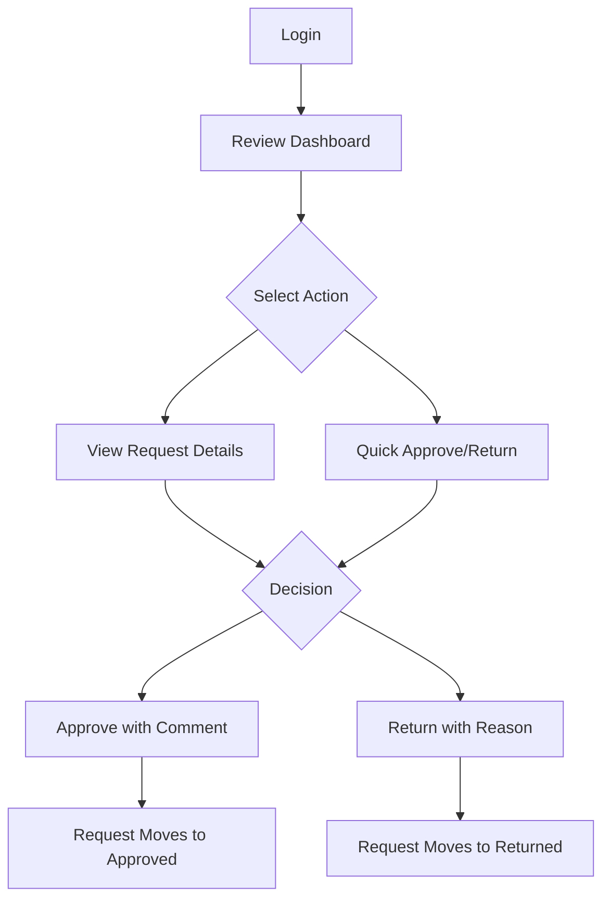

## 1. Product Overview
Review Dashboard for managing document approval workflows. The dashboard displays requests organized by their current stage and enables administrators to approve or return documents with a single click.
- Solves the problem of manual document review tracking and approval processes
- Used by administrators and managers who need to review and approve documents
- Streamlines the approval workflow with clear visual indicators and quick action buttons

## 2. Core Features

### 2.1 User Roles
| Role | Registration Method | Core Permissions |
|------|---------------------|------------------|
| Admin | System assignment | Full access to review dashboard, approve/return documents, view all stages |
| Reviewer | Admin assignment | Review documents in assigned stages, approve/return within scope |

### 2.2 Feature Module
Our review dashboard requirements consist of the following main pages:
1. **Review Dashboard**: stage-based request listing, quick action buttons, filtering options
2. **Request Details**: document preview, approval history, detailed information

### 2.3 Page Details
| Page Name | Module Name | Feature description |
|-----------|-------------|---------------------|
| Review Dashboard | Stage Navigation | Display requests grouped by workflow stages (Pending, Under Review, Approved, Returned). Allow filtering by stage with visual indicators. |
| Review Dashboard | Request List | Show request cards with document title, submitter info, submission date, current stage. Include approve/return action buttons. |
| Review Dashboard | Quick Actions | One-click approve/return functionality with confirmation modals. Update request status and move to appropriate stage. |
| Review Dashboard | Search & Filter | Enable search by document title/submitter and filter by date range, document type, or stage. |
| Request Details | Document Preview | Display document content with zoom/pan controls for detailed review. |
| Request Details | Approval History | Show timeline of all approval actions with timestamps and reviewer comments. |
| Request Details | Action Panel | Provide approve/return buttons with comment field for feedback. |

## 3. Core Process
### Admin/Reviewer Flow
1. User logs in and accesses Review Dashboard
2. Dashboard displays requests organized by current stage
3. User can filter requests by stage, date, or search terms
4. User clicks on a request to view details or uses quick actions
5. For approval: user clicks approve, adds optional comment, confirms action
6. For return: user clicks return, adds required comment explaining reason
7. Request automatically moves to appropriate stage
8. Dashboard updates in real-time to reflect changes

## 4. User Interface Design
### 4.1 Design Style
- **Primary Colors**: Deep navy (#1a2332) for headers, emerald (#10b981) for approved status
- **Secondary Colors**: Soft gray (#f8fafc) for backgrounds, coral (#ef4444) for returned status
- **Button Style**: Rounded corners (8px radius), subtle shadows, hover effects
- **Font**: System fonts (Inter, sans-serif) for readability
- **Layout**: Card-based design with clear visual hierarchy
- **Icons**: Minimal line icons for actions, filled icons for status indicators

### 4.2 Page Design Overview
| Page Name | Module Name | UI Elements |
|-----------|-------------|-------------|
| Review Dashboard | Stage Navigation | Horizontal tabs with stage names and request counts. Active stage highlighted with bottom border. |
| Review Dashboard | Request Cards | White cards with document title, submitter avatar, submission date, stage badge. Action buttons at bottom right. |
| Review Dashboard | Action Buttons | Green approve button with check icon, red return button with arrow icon. Both with hover states. |
| Request Details | Document Preview | Full-width preview area with zoom controls, page navigation for multi-page documents. |
| Request Details | History Timeline | Vertical timeline showing approval actions with user avatars, timestamps, and comments. |

### 4.3 Responsiveness
Desktop-first design approach with mobile adaptation. Dashboard uses responsive grid that collapses to single column on mobile. Touch-optimized buttons with larger tap targets on mobile devices. Side navigation converts to bottom tab bar on screens under 768px width.