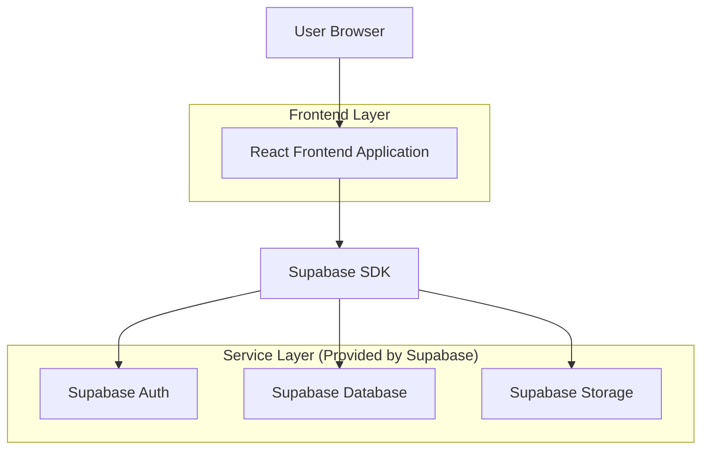
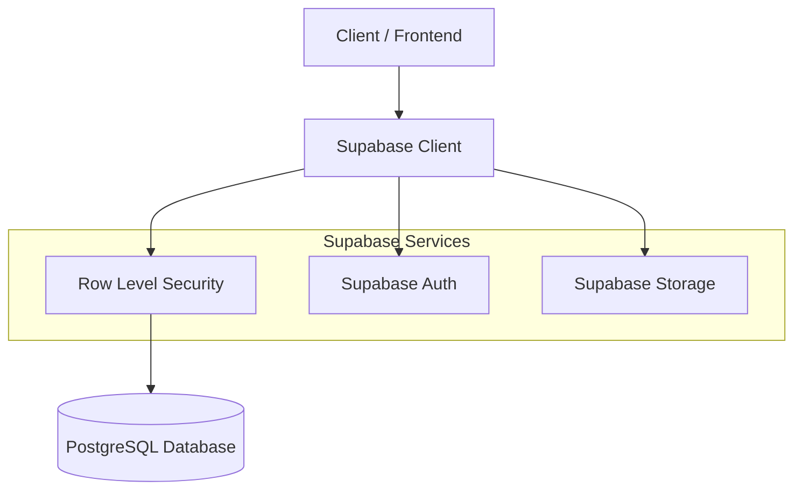
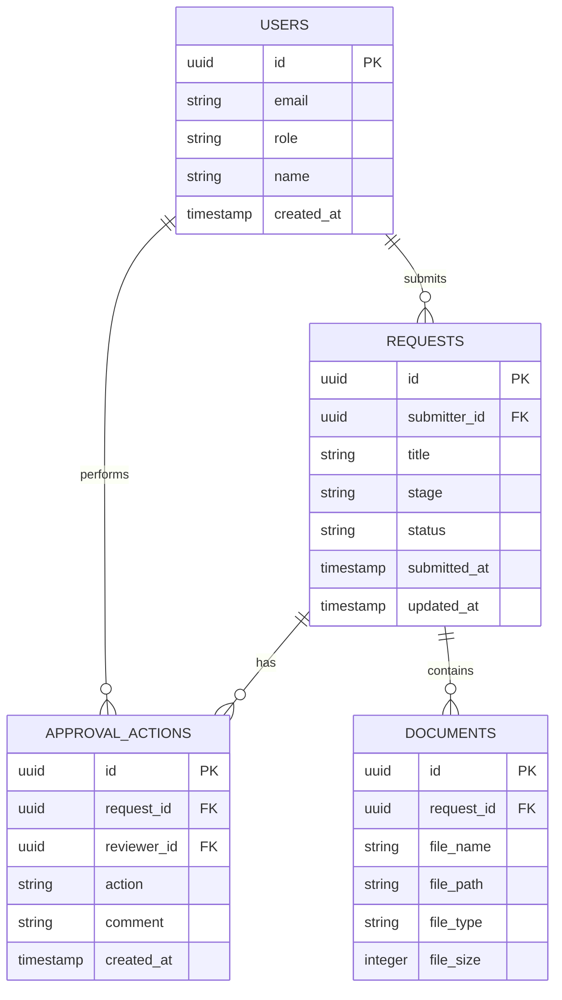

## 1. Architecture design



## 2. Technology Description
- Frontend: React@18 + tailwindcss@3 + vite
- Initialization Tool: vite-init
- Backend: Supabase (Auth + PostgreSQL + Storage)
- UI Components: Headless UI for accessible components
- State Management: React Context + Supabase Real-time subscriptions

## 3. Route definitions
| Route | Purpose |
|-------|---------|
| /dashboard | Main review dashboard showing requests by stage |
| /dashboard/request/:id | Detailed view of specific request with document preview |
| /login | Authentication page for admin/reviewer access |
| /unauthorized | Access denied page for unauthorized users |

## 4. API definitions
### 4.1 Core API

Request management related
```
GET /api/requests
```

Request:
| Param Name| Param Type  | isRequired  | Description |
|-----------|-------------|-------------|-------------|
| stage     | string      | false       | Filter by request stage |
| search    | string      | false       | Search by title/submitter |
| date_from | date        | false       | Filter by start date |
| date_to   | date        | false       | Filter by end date |

Response:
| Param Name| Param Type  | Description |
|-----------|-------------|-------------|
| requests  | array       | Array of request objects |
| total     | number      | Total count of requests |

Update request status
```
POST /api/requests/:id/status
```

Request:
| Param Name| Param Type  | isRequired  | Description |
|-----------|-------------|-------------|-------------|
| status    | string      | true        | New status (approved/returned) |
| comment   | string      | false       | Optional comment for action |

## 5. Server architecture diagram


## 6. Data model

### 6.1 Data model definition


### 6.2 Data Definition Language
User Table (users)
```
-- create table
CREATE TABLE users (
    id UUID PRIMARY KEY DEFAULT gen_random_uuid(),
    email VARCHAR(255) UNIQUE NOT NULL,
    role VARCHAR(20) NOT NULL CHECK (role IN ('admin', 'reviewer')),
    name VARCHAR(100) NOT NULL,
    created_at TIMESTAMP WITH TIME ZONE DEFAULT NOW()
);

-- grant permissions
GRANT SELECT ON users TO anon;
GRANT ALL PRIVILEGES ON users TO authenticated;
```

Requests Table (requests)
```
-- create table
CREATE TABLE requests (
    id UUID PRIMARY KEY DEFAULT gen_random_uuid(),
    submitter_id UUID REFERENCES users(id) NOT NULL,
    title VARCHAR(255) NOT NULL,
    stage VARCHAR(20) NOT NULL DEFAULT 'pending' CHECK (stage IN ('pending', 'under_review', 'approved', 'returned')),
    status VARCHAR(20) NOT NULL DEFAULT 'active' CHECK (status IN ('active', 'completed')),
    submitted_at TIMESTAMP WITH TIME ZONE DEFAULT NOW(),
    updated_at TIMESTAMP WITH TIME ZONE DEFAULT NOW()
);

-- create indexes
CREATE INDEX idx_requests_stage ON requests(stage);
CREATE INDEX idx_requests_submitter ON requests(submitter_id);
CREATE INDEX idx_requests_submitted_at ON requests(submitted_at DESC);

-- grant permissions
GRANT SELECT ON requests TO anon;
GRANT ALL PRIVILEGES ON requests TO authenticated;
```

Approval Actions Table (approval_actions)
```
-- create table
CREATE TABLE approval_actions (
    id UUID PRIMARY KEY DEFAULT gen_random_uuid(),
    request_id UUID REFERENCES requests(id) NOT NULL,
    reviewer_id UUID REFERENCES users(id) NOT NULL,
    action VARCHAR(20) NOT NULL CHECK (action IN ('approve', 'return')),
    comment TEXT,
    created_at TIMESTAMP WITH TIME ZONE DEFAULT NOW()
);

-- create indexes
CREATE INDEX idx_approval_actions_request ON approval_actions(request_id);
CREATE INDEX idx_approval_actions_reviewer ON approval_actions(reviewer_id);

-- grant permissions
GRANT SELECT ON approval_actions TO anon;
GRANT ALL PRIVILEGES ON approval_actions TO authenticated;
```

Documents Table (documents)
```
-- create table
CREATE TABLE documents (
    id UUID PRIMARY KEY DEFAULT gen_random_uuid(),
    request_id UUID REFERENCES requests(id) NOT NULL,
    file_name VARCHAR(255) NOT NULL,
    file_path VARCHAR(500) NOT NULL,
    file_type VARCHAR(50) NOT NULL,
    file_size INTEGER NOT NULL,
    created_at TIMESTAMP WITH TIME ZONE DEFAULT NOW()
);

-- create indexes
CREATE INDEX idx_documents_request ON documents(request_id);

-- grant permissions
GRANT SELECT ON documents TO anon;
GRANT ALL PRIVILEGES ON documents TO authenticated;
```